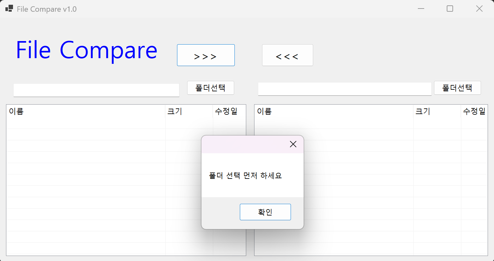
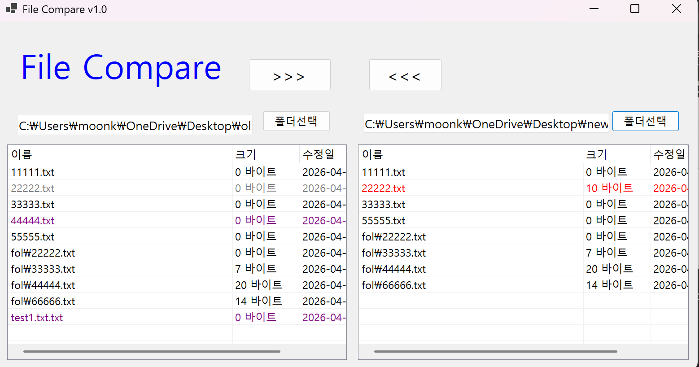
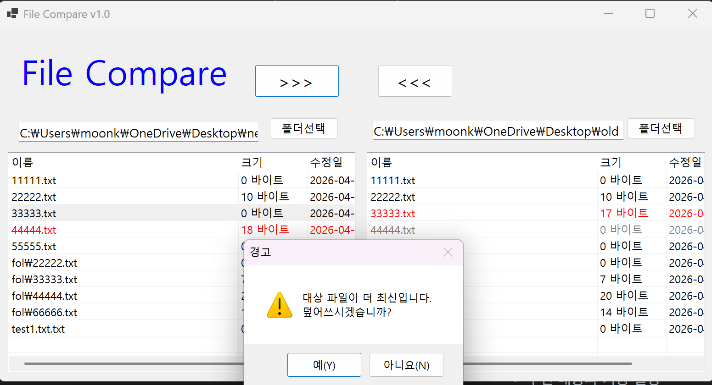

(C# 코딩)파일 비교기 (File Compare)

## 개요
- C# 프로그래밍 학습
- 1줄 소개: 사용자가 선택한 파일의 내용을 비교하는  Windows Forms 기반 프로그램
- 사용한 플랫폼:
	- C#, .NET Windows Forms, Visual Studio, GitHub
- 사용한 컨트롤:

	- Label → 프로그램 제목(File Compare) 및 상태 메시지를 표시하여 사용자가 현재 작업 상태를 쉽게 확인할 수 있도록 한다.
	- TextBox → 선택한 폴더 경로를 표시하여 사용자가 현재 비교 대상 폴더 위치를 확인할 수 있도록 한다.
	- Button → 폴더 선택, 파일 복사(>>>, <<<) 등의 기능을 실행하여 사용자와 프로그램 간의 주요 상호작용을 담당한다.
	- ListView → 선택한 폴더 내 파일 목록(이름, 크기, 수정일 등)을 표 형태로 출력하고, 파일 비교 결과를 한눈에 확인할 수 있도록 한다.

## 실행 화면 (과제1)
- 코드의 실행 스크린샷과 구현 내용 설명ddd

	- 초기화면

- 코드의 실행 스크린샷과 구현 내용 설명

	- 폴더 선택기능 구현

- 과제 내용
	- 기본 ui구성 
	- 폴더 선택 기능 구현

- 구현 내용과 기능 설명
	- 프로그램을 구성하는 기본 ui 구성
	- 폴더 선택 기능 구현으로 사용자가 비교할 폴더를 선택할 수 있도록 함.

## 실행 화면 (과제2)
- 코드의 실행 스크린샷과 구현 내용 설명

	- 파일 선택을 하지않고 복사버튼을 눌렀을 때의 예외처리 구현

- 코드의 실행 스크린샷과 구현 내용 설명

	- 두개의 폴더 선택후 파일 비교 결과 출력
		- 파일이름, 크기, 수정일자 등 비교 결과를 ListView에 출력하여 사용자가 쉽게 비교할 수 있도록 함.
		- 빨간색,회색은 두 폴더에서 다른 파일을 나타내고, 검은색은 동일한 파일을 나타냄.

- 과제 내용
	- 파일 비교 기능 구현
	- 예외 처리 구현

- 구현 내용과 기능 설명
	- 파일 비교 기능 구현으로 사용자가 선택한 두 폴더의 파일을 비교하여 결과를 ListView에 출력함.
	- 예외 처리 구현으로 사용자가 파일을 선택하지 않고 복사 버튼을 눌렀을 때 경고 메시지를 띄워 사용자에게 올바른 행동을 안내함.

## 실행 화면 (과제3)
- 코드의 실행 스크린샷과 구현 내용 설명

	- 파일 복사 기능 구현
		- 사용자가 선택한 파일을 다른 폴더로 복사하는 기능을 구현하여, 파일 관리의 편의성을 높임.
		- 최신파일에서 구버전으로 복사할 때는 최신파일이 구버전을 덮어쓰도록 구현하여, 사용자가 최신 파일을 유지할 수 있도록 함.
		- 구버전에서 최신파일로 복사할 때는 경고창을 띄워 사용자가 실수로 최신 파일을 덮어쓰는 것을 방지함.

- 과제 내용
	- 파일 복사 기능 구현
	- 최신파일에서 구버전으로 복사할 때는 최신파일이 구버전을 덮어쓰도록 구현하여, 사용자가 최신 파일을 유지할 수 있도록 함.
	- 구버전에서 최신파일로 복사할 때는 경고창을 띄워 사용자가 실수로 최신 파일을 덮어쓰는 것을 방지함.

- 구현 내용과 기능 설명
	- 최신파일에서 구버전으로 복사할 때는 최신파일이 구버전을 덮어쓰도록 구현하여, 사용자가 최신 파일을 유지할 수 있도록 함.
	- 구버전에서 최신파일로 복사할 때는 경고창을 띄워 사용자가 실수로 최신 파일을 덮어쓰는 것을 방지함.