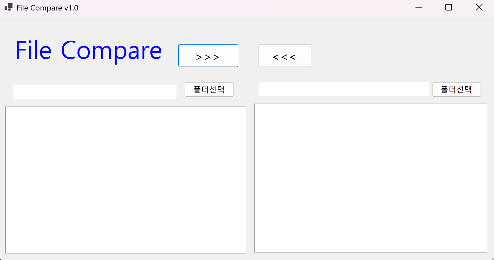
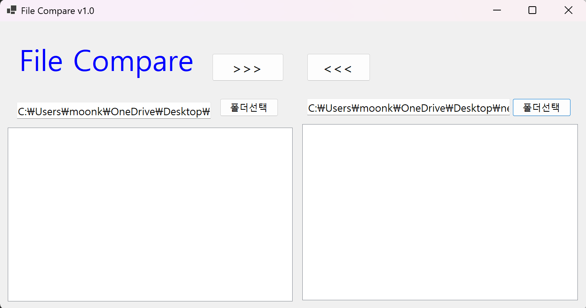

(C# 코딩)파일 비교기 (File Compare)

## 개요
- C# 프로그래밍 학습
- 1줄 소개: 사용자가 선택한 파일의 내용을 비교하는  Windows Forms 기반 프로그램
- 사용한 플랫폼:
	- C#, .NET Windows Forms, Visual Studio, GitHub
- 사용한 컨트롤:

	- Label → 프로그램 제목(File Compare) 및 상태 메시지를 표시하여 사용자가 현재 작업 상태를 쉽게 확인할 수 있도록 한다.
	- TextBox → 선택한 폴더 경로를 표시하여 사용자가 현재 비교 대상 폴더 위치를 확인할 수 있도록 한다.
	- Button → 폴더 선택, 파일 복사(>>>, <<<) 등의 기능을 실행하여 사용자와 프로그램 간의 주요 상호작용을 담당한다.
	- ListView → 선택한 폴더 내 파일 목록(이름, 크기, 수정일 등)을 표 형태로 출력하고, 파일 비교 결과를 한눈에 확인할 수 있도록 한다.

## 실행 화면 (과제1)
- 코드의 실행 스크린샷과 구현 내용 설명

	- 초기화면

- 코드의 실행 스크린샷과 구현 내용 설명

	- 폴더 선택기능 구현

- 과제 내용
	- 기본 ui구성 
	- 폴더 선택 기능 구현

- 구현 내용과 기능 설명
	- 프로그램을 구성하는 기본 ui 구성
	- 폴더 선택 기능 구현으로 사용자가 비교할 폴더를 선택할 수 있도록 함.